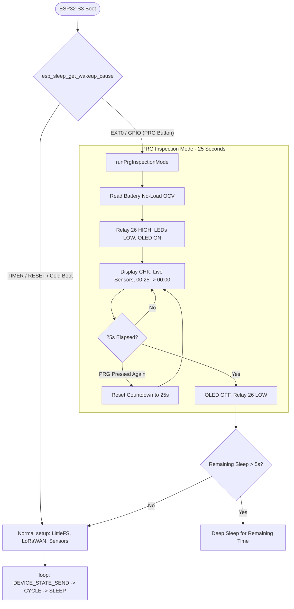

# Design Specification: PRG Inspection Mode & Deep Sleep Architecture

- **Date**: 2026-10-10
- **Target File**: `src/main.cpp`
- **Context Document**: `floodguard_master_node_context.md`
- **Status**: Approved by User

---

## 1. Overview & Objectives

This updated specification addresses the **Deep Sleep Wake-up Architecture** of the Heltec WiFi LoRa 32 V3 Master Node:

1. **Root Cause of RST-like Behavior**:
   - In Heltec LoRaWAN Class A, `LoRaWAN.sleep(loraWanClass)` calls `Mcu.sleep()`, which puts the ESP32-S3 into **Hardware Deep Sleep** (`esp_deep_sleep_start()`).
   - Waking up from Deep Sleep (via Timer or PRG button GPIO 0 / EXT0) **reboots the CPU** and executes `setup()` from line 1.
   - Because `setup()` did not check `esp_sleep_get_wakeup_cause()`, it treated PRG wake-ups as normal cold boots, mounting Flash, initializing LoRaWAN, and triggering an immediate uplink transmission.

2. **Dedicated Inspection Routine (`runPrgInspectionMode()`)**:
   - At the very first line of `setup()`, check `esp_sleep_get_wakeup_cause()`.
   - If woken by PRG (`ESP_SLEEP_WAKEUP_EXT0` or `ESP_SLEEP_WAKEUP_GPIO`), branch immediately to `runPrgInspectionMode()`.
   - **Zero LoRaWAN Interaction**: Do NOT initialize LoRaWAN (`LoRaWAN.init()`), do NOT touch Flash backlog, and keep SX1262 radio asleep.
   - Initialize only sensors (GPS, ESP32-C3 ultrasonic/gyro, SHT30, ADC Battery) and OLED display.
   - Read No-Load OCV before energizing Relay 26.
   - Energize Relay 26 (GPIO 26) and turn on OLED displaying status `CHK` and countdown `00:25` -> `00:00`.
   - Keep Red (GPIO 4) and Green (GPIO 5) LEDs completely **LOW** (OFF).
   - If PRG is pressed again during the 25 seconds, reset the countdown back to 25s.
   - After 25 seconds, shut off OLED and Relay 26, calculate remaining sleep time from RTC (`RtcGetTimerValue()`), and return to Deep Sleep for the exact remaining duration.
   - If remaining sleep time $\le 5\text{s}$ (10-minute cycle arrived during inspection), return from `runPrgInspectionMode()` to let `setup()` continue with the scheduled LoRaWAN transmission.

3. **Battery Stabilization Fix**:
   - Set `newCycleSoCAllowed = true;` at start of `DEVICE_STATE_SEND`.
   - Scale `maxAllowedDrop` proportionally with `TOTAL_CYCLE_MS`.
   - Measure No-Load OCV before Relay ON in both normal cycles and PRG inspection mode.

---

## 2. State & Data Flow Diagram

---

## 3. Verification Plan
- Compile cleanly with PlatformIO.
- Verify cold boot proceeds to LoRaWAN Join & Send.
- Verify PRG wake during deep sleep:
  - Does NOT print `[FLASH]` or `confirmed uplink sending`.
  - Turns OLED on with `CHK` and `00:25`.
  - LEDs stay OFF.
  - Relay 26 activates.
  - After 25 seconds, shuts off OLED & Relay and returns to Deep Sleep.
